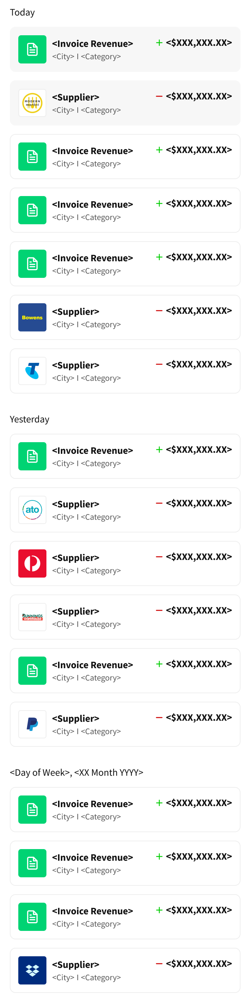

# Thriday Front End Technical Challenge

## Introduction

Our React.js technical interview process involves candidates doing an at-home project to test your React.js knowledge and problem solving abilities, while also giving you a chance to write code in a way that you find comfortable.
Using Google/StackOverflow/whatever for help is allowed, but ultimately you should write and be able to justify every piece of the code being submitted.
Your solution should be shared on a public Github or Bitbucket repo showing all commit history.

## Requirements

* Use ReactJS (create-react-app encouraged)
* You can use either Hooks or standard react, but in either case the correct use of state and props is required, as well as correct component abstraction (i.e. knowing when to make something a subcomponent)
* This is not a UX test, focus on the functionality

## The Challenge

We have provided a JSON file containing a small sample from an API response; it contains a list of Transactions. Using this JSON data, build a React app that implements the following design.

| Breakpoint      | Design      |
|------------|-------------|
| Desktop |   |
| Mobile |  |

### Assets

* You can find the design on Figma here.
* The Overpass font is available on Google Fonts.

### Acceptance Criteria

The list of transactions should be grouped by date (the "date" property).

Each group of transactions should display a title showing the date of the group (don't worry about handling the "Today" and "Yesterday" titles).

All Transactions should display:

* a logo (the "logoUrl" property)
* a title (the "transactionTitle" property)
* a subtitle
  * the "suburb" property, if it has a value
  * the "shortCategory" property, if it has a value
  * if both properties have values, display a separator between them
* an amount (the "amount" property)
  * styled differently based on the "cashflow" property
    * when cashflow == "inflow"
      * prefix with "+"
      * colour green
      * display the green "up" arrow icon (only visible at non-mobile breakpoints)
    * when cashflow == "outflow"
      * prefix with "-"
      * colour black
      * display the red "down" arrow icon (only visible at non-mobile breakpoints)
* "Pending" Transactions ("status" == "PENDING") should be shown with a dark grey background colour, and a "Pending" tag that is only visible at non-mobile breakpoints.
